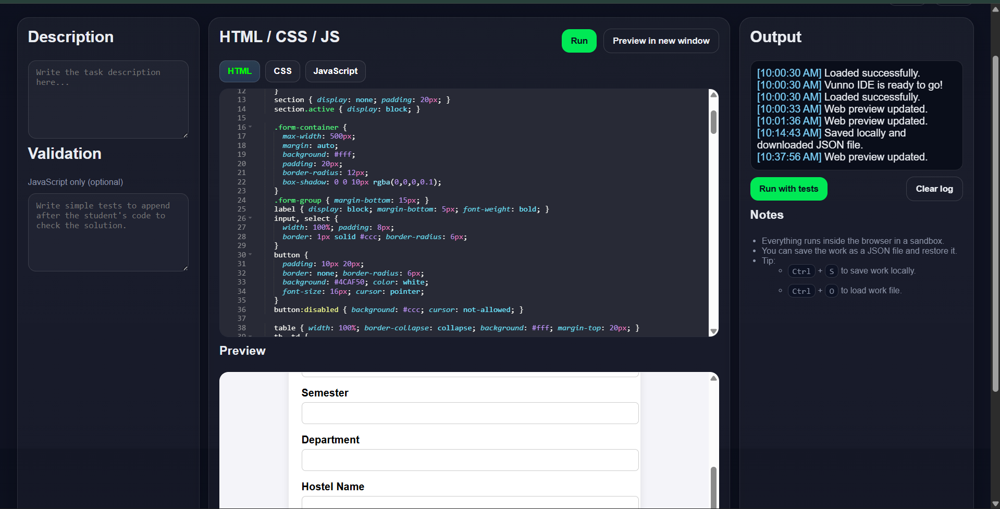

# Vunno Editor (In-browser IDE)

Vunno Editor is a lightweight, online code editor for HTML, CSS, and JavaScript with live preview, simple validation tests, and local project, all running within the browser.

It’s designed for learning, teaching, and prototyping, without requiring any backend or setup.

---

## Project Overview

The project combines ACE editor library with iframe and localStorage. JSON-based project export/import and dynamic code injection with validation support.

**The application provides:**

- Multi-language editor
Write and switch between HTML, CSS, and JavaScript using Ace Editor.

- Live Preview
Instantly render your code in a sandboxed iframe.

- Validation Tests
Add JavaScript-based test code to verify solutions.

- Save & Load Projects
Auto-save to localStorage
Export / import projects as JSON files

- Keyboard Shortcuts
 Ctrl + Enter → Run preview
 Ctrl + S → Save project
 Ctrl + O → Load project

---

## Core Features

 - Code is written in Ace Editor instances.
 - HTML, CSS, and JS are combined into a single document using srcdoc.
 - The preview runs inside a sandboxed iframe.
 - Optional test code is appended and executed safely.
 - Projects can be saved/restored via JSON or browser storage.

---

## Tech Stack

- HTML
- CSS
- Vanilla JS
- ACE editor API

---
## Use Cases

- Learning frontend development
- Executing coding assignments
- Running quick HTML/CSS/JS experiments
- Browser-based coding assessments
- Offline practice environments
---

## Project Structure
```bash
Embeded-Code-Editor/
|
├── public/
│   ├── index.html
│   └── assets/
│       ├── images/
│       ├── styles.js
│       └── app.js
│
├── package.json
├── LICENSE
└── README.md
```
---
## Setup Instructions
### Clone the Repository

```bash
git clone https://github.com/vivekisntit/Embedded-Code-editor.git
cd Embeded-Code-Editor
```
---
## Preview



